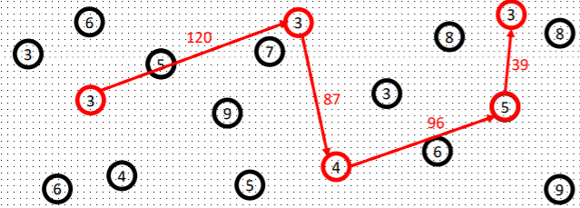
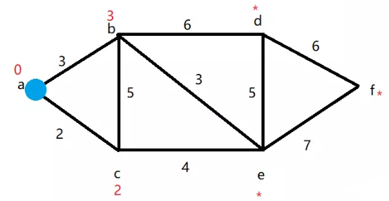
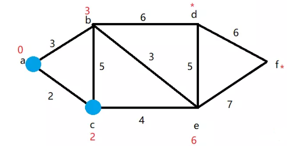
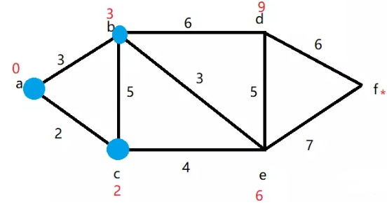
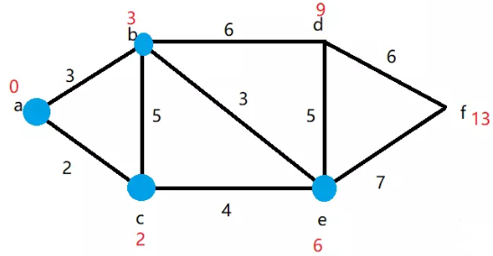
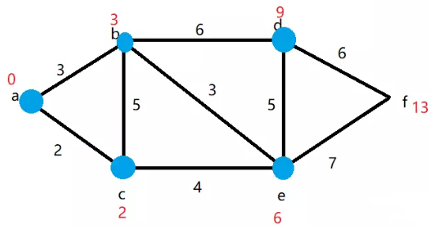

# Path planning for energy distribution system
Study notes of UAV path planning for energy distribution system.

## Wireless power transfer background
Consider a two-stage energy distribution system [1]. 
    1. UAV interacts with center senosr node(s)
    2. Center sensor node(s) interact with other nodes

For inductive power delivery, Ampere's Law and Faraday's Law need to be applied. The flux linkage looks like [2]:  

The induced voltage is expressed by:

For acoustic power distribution, there's piezoelectric driver and transducer in each sensor node. Therefore the energy of the storage capacitor **ESC** at any time **t** can be expressed as:

where **Em** is the energy consumption from storage capacitor within an unit timestamp, **T** is the acoustic power transmitted to other nodes within an unit timestamp, **R** is the acoustic power transmitted from other nodes, **I** is indevtice power transmitted from the UAV. 

## Single weighted node clustering and multi-clusters
Therefore, to find the optimal center node, iterative loop is required. This search is bounded by acoustic limits. The choosing criteria should be:

where d(P, Pi) is the distance between node i position and current node position, wi is the weighing parameter of node i (the energy of storage capacitor). This is because the altitude of UAV will affect the number of charging nodes.

Then for larger planes, multiple clusters will be formed like following figure [3]:

The algorithm is aimed at finding the minimum path.

## Dijkstra's algorithm
The method is to find the shortest path between two nodes in weighting system G = {V, E}. Basically, the main concept is marking each node with (length or * as unknown) and separating G into two sets V1 (node length which is already known) and V2 (node length which is unknown). Consider the following example - assuming we have 6 nodes and from node **a** to destination node **f**:

1. starting node a = 0, b = 3, c = 2, V1 = {a}, V2 = {b, c, d, e, f}

2. starting node c, b = 2+5 = 7 > 3 (keep 3 then), e = 2+4 = 6, V1 = {a, c}, V2 = {b, d, e, f}

3. starting node b, d = 3+6 = 9 , e = 3+3 = 6, V1 = {a, c, b}, V2 = {d, e, f}

4. starting node e, d = 6+5 = 11 > 9 (keep 9 then), f = 6+7 = 13, V1 = {a, c, b, e}, V2 = {d, f}

5. starting node d, f = 9+6 = 15 > 13 (keep 13 then), e = 9+5 = 14 > 13 (keep 13 then), V1 = {a, c, b, e, d}, V2 = {f}

Then we can get shortest path (a, c, e, f) or (a, b, e, f) and total length is 13.

## Implementation 
This algorithm will be realized through C++. See [Dij_algorithm](Dij_algorithm.cpp) for more information.

# Reference 
[1] D. E. Boyle, S. W. Wright, M. E. Kiziroglou, A. Y. S. Pandiyan, and E. M.
Yeatman, "Inductive Power Delivery with Acoustic Distribution to Wireless
Sensors," in Wireless Power Week, London, UK, 2019.

[2] Abdolkhani, A (2016) Fundamentals of inductively coupled wireless power transfer systems. In Coca, E (ed.), Wireless Power Transfer – Fundamentals and Technologies. Rjieka, Croatia: InTech.

[3] D. E. Boyle, S. W. Wright, M. E. Kiziroglou, A. Y. S. Pandiyan, and E. M.
Yeatman, "Optimal energy distribution using clustering algorithm"